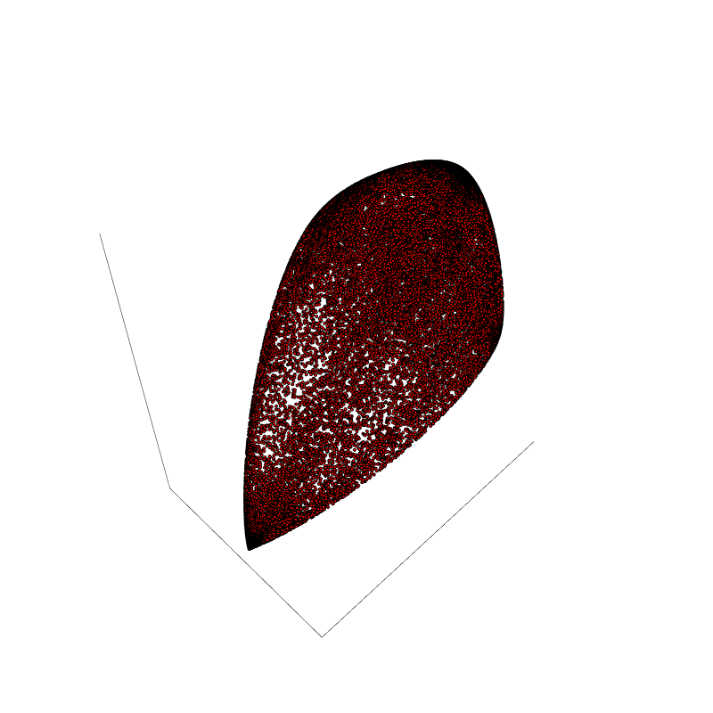

# Compute an approximattion of the fiber body of Gram spectrahedra of binary sextics
This Julia code can be used to reproduce a similar picture to the one in [this paper](https://arxiv.org/abs/2303.05815), Figure 1.

The following code considers the Gram spectrahedra of $m$ binary sextics and $n$ random directions in 3-space. For every direction the minimizer is computed on every of the $m$ Gram spectrahedra.
This produces $n$ points on the boundary of each Gram spectrahedron. The approximation of the fiber body is then the Minkowski sum (up to scaling) of these $m$ Gram spectrahedra.
Increasing $n$ produces more points on the boundary. Increasing $m$ approximates the fiber body better as it is the limit for $m\to\infty$ if the samples are well distributed.

The next three lines produce an approximation of the fiber body with $n$ boundary points and as the Minkowski sum of $m$ Gram spectrahedra.
```
random_directions(n)
sample(m)
draw_fb()
```

If $m,n$ should be large one may also save the list and reload the next time. Simply use

```save_to_file()```

and next time

```
S = load_from_file()
L1 = S[1]
L2 = S[2]
L3 = S[3]
directions = S[4]
```

To then draw the picture use
```draw_fb()```.

The picture should look similar to 


